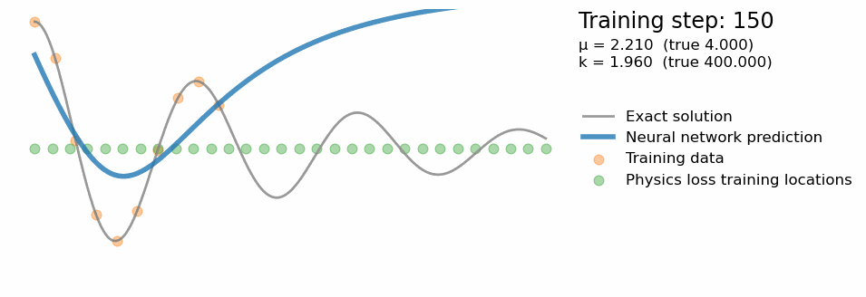

 # extension: inverse problem with PINNs for harmonic oscillator

TLDR; extended this project to introduce an inverse problem of finding the parameters mu, k for a harmonic oscillator and solve it using a similar PINN architecture.

The original copy of this repo accompanies the OPs blog post [So, what is a physics-informed neural network?](https://benmoseley.blog/my-research/so-what-is-a-physics-informed-neural-network/)

Result from solving forward problem using pinns:

Find more extensive write-up in jupyter notebook <- details of why we use a PINN and problems I came up across when developing this demo.

Here were 2 results from running different simulations for this inverse problem. The first one assumes a good estimate for our starting parameters (perhaps we know a rough estimate for our learnable parameters), and the second shows us starting at a default point e.g. 1.0. 

Quite expected the second run took the PINN longer to form a better estimate of our model but it was interesting to see it actually moved towards to correct directions for both parameters even though we used one PDE to encode all physics information. With my current expectations I thought we would need separate equations to add to our loss function to describe more information about our parameters i.e. bounds, magnitude, sign, relationships etc. So, it was cool to see it still be able to work out in which way we should move for both parameters.
